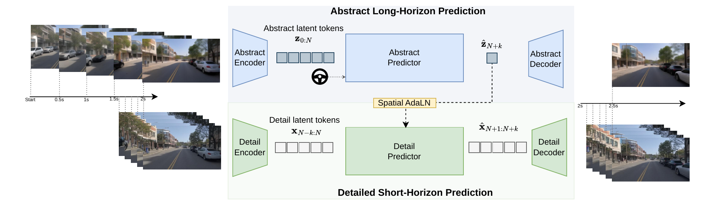

# Orbis 2: A Hierarchical World Model for Driving
**Official Implementation**
## [Paper (TODO)](https://arxiv.org/abs/XXXX.XXXXX) | [Project Page](https://lmb-freiburg.github.io/orbis2.github.io/) | [HuggingFace Demo](https://huggingface.co/spaces/sud0301/orbis2_test) | [Orbis 1](https://lmb-freiburg.github.io/orbis.github.io/)

>[Sudhanshu Mittal*](https://lmb.informatik.uni-freiburg.de/people/mittal/), [Arian Mousakhan*](https://lmb.informatik.uni-freiburg.de/people/mousakha/), [Silvio Galesso*](https://lmb.informatik.uni-freiburg.de/people/galessos/), [Karim Farid](https://lmb.informatik.uni-freiburg.de/people/faridk/), [Johannes Dienert](https://lmb.informatik.uni-freiburg.de/people/dienertj/), [Rajat Sahay](https://lmb.informatik.uni-freiburg.de/people/sahayr/), [Thomas Brox](https://lmb.informatik.uni-freiburg.de/people/brox/index.html)
> <br>University of Freiburg<br>
> <sub>* Main contributors</sub>

<!-- <table>
  <tr>
    <td></td>
    <td></td>
  </tr>
  <tr>
    <td></td>
    <td></td>
  </tr>
</table> -->



Orbis-2 is a hierarchical driving world model that generates long-horizon future video conditioned on past frames and an optional **steering signal**. A frozen low-frame-rate **L2** predictor provides abstract long-range context, while the **L1** detail predictor autoregressively generates high-frame-rate future frames. Steering can be given either as raw ego-motion values (speed and yaw rate) or as a 2D trajectory that the model should follow.

## Installation
```bash
git clone https://github.com/lmb-freiburg/orbis2.git
cd orbis2
conda env create -f environment.yml
conda activate orbis2_env
```

## Checkpoints
Clone the [Huggingface repository](TODO) containing the necessary model weights and config files:
```bash
git clone TODO
```

## Video Generation (Roll-out)
`evaluate/rollout_demo_v2.py` rolls out the world model from a single input video: it samples the L1 (high-rate) and L2 (low-rate, further back in time) context windows directly from the video, then autoregressively generates future frames.

Set the environment variable `ORBIS2_MODELS_DIR` with the path of the checkpoints folder, e.g.:
```bash
export ORBIS2_MODELS_DIR=(TODO)
```

To roll out the model using an input context video:
```bash
python evaluate/rollout_demo_v2.py \
    --video /path/to/input_video.mp4 \
    --output_dir rollout
```

To roll out with trajectory steering and an ego-centric trajectory overlay, specify an input trajectory file:
```bash
python evaluate/rollout_demo_v2.py \
    --video /path/to/input_video.mp4 \
    --trajectory_file trajectory.csv \
    --vis_mode trajectory_ego \
    --output_dir rollout_traj
```


### Useful options
The L1 frame rate is not a CLI argument: it is read automatically from the config (`data.params.validation.params.frame_rate`).

| Argument | Description |
|---|---|
|`--num_rollout_steps`| Number of rollout steps to perform. Each step generates 0.5s of video. |
| `--config` | Config path, relative to `$ORBIS2_MODELS_DIR`. For example, it can be set to `L1/config_distill.yaml` |
| `--start_frame` | Native-video frame index where the L1 context window starts (defaults to the latest window that fits). Enough video history must precede it for the L2 context. |
| `--vis_mode` | `none`, `trajectory` (static bird's-eye panel), or `trajectory_ego` (ego-centric panel that follows the current pose). |
| `--speed_scale`, `--yaw_rate_scale` | Global multiplicative factors on the raw speed / yaw-rate conditioning, used for the counterfactual steering evaluation in the paper. |
| `--evaluate_ema` / `--use_ema` | Whether to sample with the EMA weights (default `True`). |
| `--decode_device` | Device used for decoded rollout frames; `cpu` (default) reduces peak GPU memory during saving. |
| `--compile` | Wrap the networks with `torch.compile` for faster inference; combine with `--compile_mode` and `--compile_artifacts` to tune / cache the compiled graphs across runs. |

## License (TODO)


## BibTeX (TODO)
```bibtex
@article{orbis2_2026,
  author    = {Mittal, Sudhanshu and Mousakhan, Arian and Galesso, Silvio and
               Farid, Karim and Dienert, Johannes and Sahay, Rajat and Brox, Thomas},
  title     = {Orbis 2: A Hierarchical World Model for Driving},
  journal   = {arXiv preprint arXiv:XXXX.XXXXX},
  year      = {2026},
}
```
